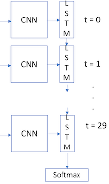

# Human Action Recognition with CNN + RNN

This project is designed to classify human action recognition datasets with a CNN + LSTM model.

Different datasets can easily be used in by adding a simple class in the datasets.py class. 

While I use ResNet18 as the CNN in this model, it can easliy be exchanged by different CNN architectures.

Here's an image of the general model design:

To get started all you have to do is 
1. Download a human action recognition dataset (I use HMDB51) http://serre-lab.clps.brown.edu/resource/hmdb-a-large-human-motion-database/#Downloads
2. Create a folder called "datasets" in the root of the project directory.
3. Put the HMDB dataset in the datasets directory, unzip it, and rename it to "HMDB". Within the HMDB folder, unzip/unrar any actions you want recognized.
4. Run this notebook!

You should have a directory that looks something like this:

>CNN_RNN_Human_Action_Recognition/datasets/HMDB/situp/  
CNN_RNN_Human_Action_Recognition/datasets/HMDB/walk/  
CNN_RNN_Human_Action_Recognition/datasets/HMDB/pushup/  
CNN_RNN_Human_Action_Recognition/datasets/HMDB/run/  
CNN_RNN_Human_Action_Recognition/datasets/HMDB/throw/  
